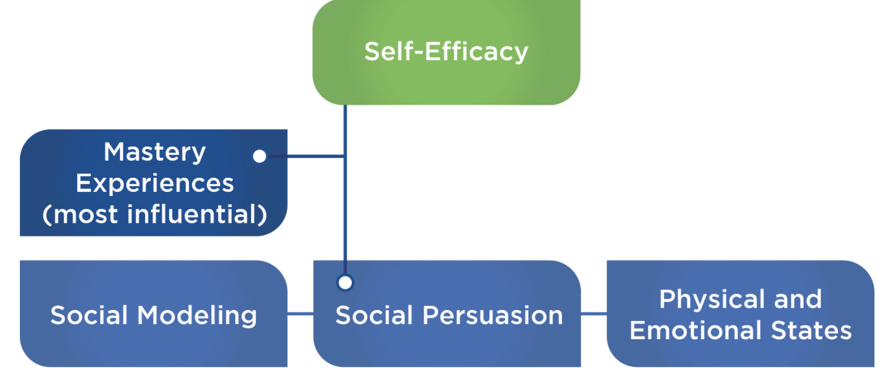

# Psychology of Body Image and Low Self-Esteem

When it comes to how people perceive and judge their bodies, there are a few variables to consider: **body reality**, **body** **ideal**, and **body image**.

Body reality :Based on a person’s measurable attributes such as height, weight, body-fat percentage, and waist circumference.

Body ideal:Refers to what a person believes or wishes their own body looked like.

Body Image: How someone perceives his or her body to look, which may not be how the person actually looks.

**Self-esteem** is how an individual views themselves with regard to their worthiness and abilities.

poor self-esteem and poor body image feed into each other in a negative feedback loop

To OverCome this:

Build Confident  and Self-efficacy , which has a strong influence over what a person chooses to do, how much effort will be put into a given behavior, and how much a person remains committed to a behavior, especially when faced with challenges

Levels of self-efficacy can change based on several variables: mastery experiences, social modeling, social persuasion, and physical and emotional responses

Mastery experiences:  if someone had healthy eating patterns in the past, they are more likely to resume those habits

Social modeling is often described as **vicarious experiences**, in which someone else successfully models a behavior. 

Social Persuasion

| **Positive** | **Negative** |
| :--- | :--- |
| Encouraging a client to do some extra cardio following a social gathering that included indulging in extra calories. | Telling a client not to worry about skipping workouts when their schedule gets busy. |
| Telling a client about a new organic protein bar that is inexpensive and fits their food plan. | Encouraging a client to splurge on dessert so that they can stay ahead of any cravings. |
| Letting a client know you are extremely proud of their progress and to keep up the great work. | Informing a client that you are very disappointed in their lack of progress in the past few weeks. |
|  |  |

