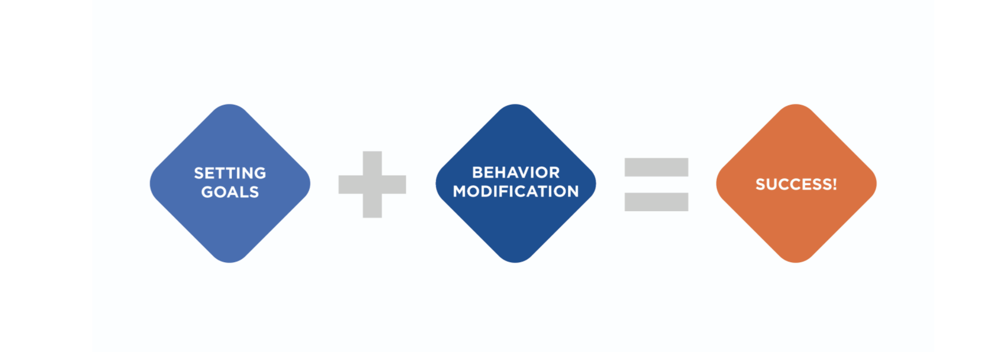
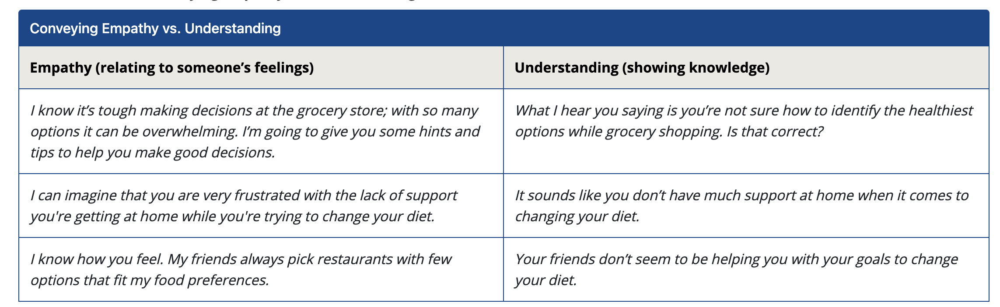
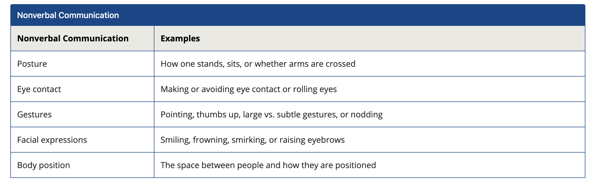
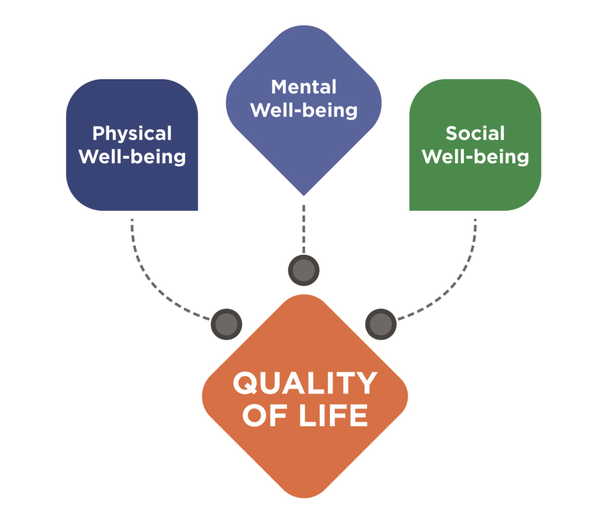
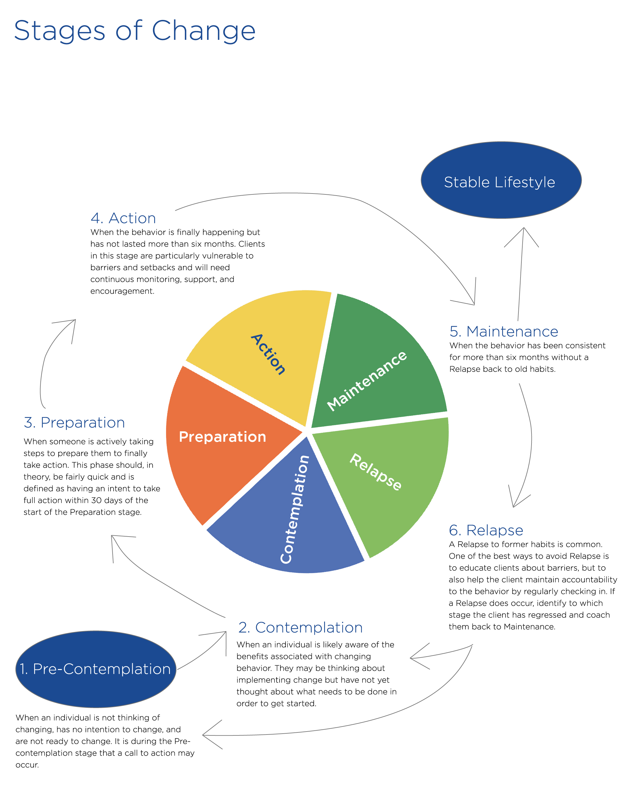

# The Science of Psychology

**Psychology** is the study of the mind and behavior.

Psychology is mainly based on **qualitative** inquiry, which relies on being able to observe _behaviors_ and assess individuals based on what is being said. 

**Quantitative** Research: Focuses on variables that can be directly measured and assessed.

**Qualitative** Research: Focuses on people in terms of how situations and experiences are perceived and how people interact and utilizes interviews and observations where the results are grouped together by themes that have emerged.

### The Desire to Change

Motivation can be both intrinsic and extrinsic in nature

Intrinsic motivation describes when people are motivated by an **internal drive** to be **competent** or **successful**, these people are fulfilled when they master a skill or behavior change.

Extrinsic motivation refers to being motivated by **rewards and recognition.**

1. Clearly define the client’s goals.

2. Identify all behaviors that will accomplish the goals.

## Communication

One of the keys to effective communication is conveying empathy. **Empathy** is when someone identifies with another person’s feelings, attitudes, or thoughts. 

To identify with others and show empathy, it is crucial to not be judgmental and to convey understanding.

Nonverbal communication is as important

Achieving a favorable quality of life should be one of the biggest selling points to initiate and continue behavior modification.

Quality of life is important to monitor as it is a way to determine if a behavioral change is effective or not.

**Transtheoretical Model aids behavior change**

