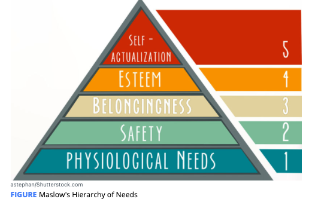
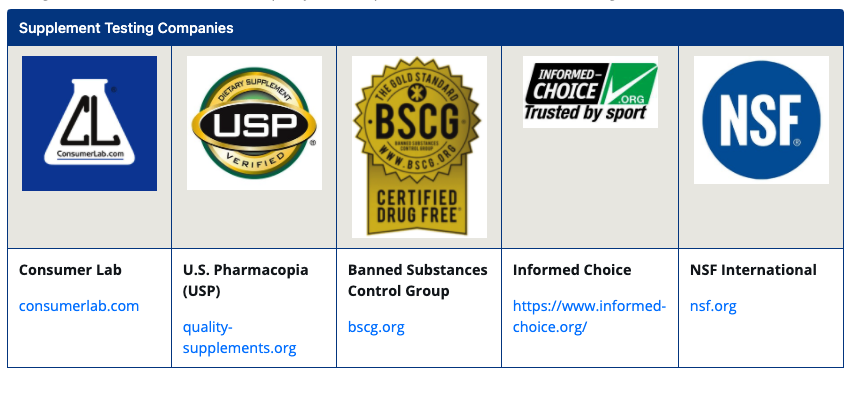
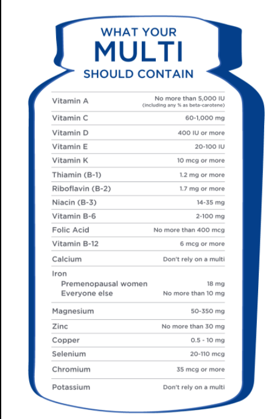

# Introduction to Dietary Supplements

daily energy requirements for health need to be met before undertaking more specific dietary strategies and supplementation.

**5 -** Proper supplementation to support **body** **composition**, training, and **performance**

**4 -** Meeting **micronutrient** needs based on nutritional gaps in the diet

**3 -** Tailoring **carbohydrate** and fat amounts and timing based on client preferences and energy needs for training and competition

**2 -** Meeting daily **protein** requirements for the desired outcomes

**1 -** Daily **energy** needs according to the client’s goal and demands of the activity

This model implies that daily energy needs, protein intake, and essential nutrient requirements are of higher priority than supplements, including **ergogenic aids** because they have a greater impact on the individual’s body composition or performance goals compared to supplements.

**ergogenic aids ：** Something that improves either physical or mental performance.

### Regulation of Dietary Supplements

I**n the United States,** the regulation of supplements is dictated by the Dietary Supplement and Health and Education **Act** \(**DSHEA**\) of 1994 \(U.S. Food and Drug Administration, 2018\). Under the provision of the DSHEA, dietary supplements, which include herbs, botanicals, vitamins, minerals, and other ingredients, are regulated as food products.

**over-the-counter medication and prescription drugs** are subject to premarket testing and approval by the U.S. Food and Drug Administration **\(FDA\)**

\*\*\*\*

Manufacturers of dietary supplements are responsible for adopting **current good manufacturing practices \(cGMPs\),**which are standards and guidelines to ensure supplements are made properly.

Manufacturers are also obligated to make accurate label claims and are prohibited from marketing supplements to prevent, treat, cure, or diagnose a disease.

label claims for supplements **do not have to be approved** by the Federal Trade Commission \(FTC\) or the FDA prior to their sale and marketing.

the FDA performs annual **inspections of randomly** selected manufacturing sites to assess compliance with cGMPs.

In the 2016 FDA Inspection Report of nearly 5**00 manufacturing facilities**, infractions were found at nearly **2/3 of the facilities**

\*\*\*\*

\*\*\*\*

### Guidelines for Supplement Selection

####   Research

Credible resources include the [National Institute of Health’s Office of Dietary Supplements](https://ods.od.nih.gov/), the [Micronutrient Information Center of the Linus Pauling Institute](https://lpi.oregonstate.edu/mic), and other reputable organizations such as the [Academy of Dietetics and Nutrition](https://www.eatrightpro.org/) and the [International Olympic Committee](https://www.olympic.org/the-ioc), all of which offer position papers on various topics related to exercise and sports nutrition, supplements, and ergogenic aids.

Scientific, peer-reviewed research reviews and clinical trials available on PubMed are generally reliable resources with limitations to studies, sometimes including a small number of participants, inadequate duration, and lack of control of influencing factors

#### Dosages, Ingredient Form, and Study Populations

the **formula** of the product, including amounts and forms of the ingredients, should ideally match well-designed human clinical trials, which include a **control group**, **randomization** of the supplement\(s\) and **placebo**, the **measurement** of **relevant** **outcomes**, and a c**ontrol for any confounding variable**s.

supplement companies frequently tout some forms of ingredients to be superior to others

dose of the ingredients included in the product, which may not match study protocols.

it is not required by law for supplement manufacturers to **prove their products are safe or effective;** however, companies are legally obligated to have scientific research that supports the safety and efficacy of their products and should be able to provide this documentation on request.

#### Independent Testing

The major companies in the United States that provide certification to verify the content of their supplements include Consumer Lab, U.S. Pharmacopeia \(USP\), Informed Choice, Banned Substances Control Group \(BSCG\), and NSF International

\*\*\*\*

**Consumer Lab**’s quality evaluation requires that products from consumer channels be **randomly tested** **once a year.** Approval indicates the product was tested for **ingredient identity, strength** \(amounts stated on the label\), **purity** \(free of specified contaminants\), and **disintegration** \(Consumer Lab, 2018\).

**USP’s Dietary Supplement Verification Program** ensures the product contains the ingredients and amounts listed on the label, **is free from harmful levels** of specified contaminants \(e.g., pesticides, heavy metals, or microbes\), is made in a facility that is compliant to **cGMPs**, and will breakdown in the body within a specified time. Products are also tested **annually** to retain the USP Verified mark \(U.S. Pharmacopeia, 2018\).

**BSCG’s Certified Drug-Free program, Informed Choice’s Registration Process, and NSF International’s Certified for Sport program**  to **hidden drugs and banned substances** in **sports** is also conducted to varying degrees .  ****to include the certifier’s logo and are listed on the certifier’s website.

Major League Baseball, the National Hockey League, and the Canadian Football League require members to utilize **only** **NSF** Certified-for-Sport products.

National Football League, the Professional Golf Association, and the Collegiate and Professional Sports Dietitians Association, **recommend** NSF Certified-for-Sport products.

### Multivitamin and Mineral Supplements

The proper use of dietary supplements, particularly multivitamin and mineral formulas, has been shown to help fill common and widespread nutrient gaps.

 Achieving daily requirements for major minerals such as calcium, magnesium, iron, and other essential nutrients, such as vitamin D and the omega-3 fatty acids **DHA** and **EPA**, may require separate supplementation. 

